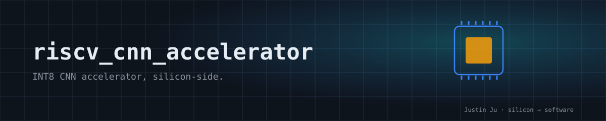

<p align="center">
  
</p>

# Lightweight CNN Accelerator for RISC-V (Hummingbird E203)

**INT8 CNN accelerator, silicon-side.**
**硬件侧,直接说话。**

A lightweight CNN accelerator integrated with the Hummingbird E203 RISC-V core through the NICE interface. Evidence before claims — experimental interfaces are documented as such, never implied as production capability.

轻量 CNN 加速器,经 NICE 接口集成 Hummingbird E203。证据优先于声明,实验接口不会冒充完整能力。

## Key Features / 关键规格

| Item | Spec |
|---|---|
| Host core | Hummingbird E203 (`RV32IMAC`) |
| Interface | NICE valid/ready request-response flow |
| Data precision | INT8 weights and activations, INT32 accumulation |
| Architecture | 4×4 PE array, output-stationary dataflow |
| Delivery baseline | Minimal CNN v1 + board-prep automation |

## Repository Entry / 仓库入口

`main` is the maintained landing branch for documentation, CI, and release
navigation. The FYP is complete; retained engineering branches are research
snapshots rather than active delivery lines.

| Role | This repo branch | Paired SoC repo branch |
|------|------------------|------------------------|
| Maintained landing line | `main` | `main` |
| Retained A7 engineering snapshot | `codex/a7-bringup-v2-main` | `codex/a7-bringup-v2-soc` |
| Reproducible baseline milestone | [`env-baseline-2026-07-27`](https://github.com/Justin-Ju-0413/riscv_cnn_accelerator/releases/tag/env-baseline-2026-07-27) | [`env-baseline-2026-07-27`](https://github.com/Justin-Ju-0413/e203_hbirdv2/releases/tag/env-baseline-2026-07-27) |
| MPhil NICE v2 PoC | [`mphil-nice-v2-poc-v0.1.0`](https://github.com/Justin-Ju-0413/riscv_cnn_accelerator/releases/tag/mphil-nice-v2-poc-v0.1.0) | [`mphil-nice-v2-poc-v0.1.0`](https://github.com/Justin-Ju-0413/e203_hbirdv2/releases/tag/mphil-nice-v2-poc-v0.1.0) |

Start with the paired Releases above: the baseline is the reproducible FYP
environment, and the MPhil tag is a bounded `CAP`/`MLOAD`/`MSTAT` proof of
concept. The experimental work does not imply tiled GEMM, DMA, `MEXEC` or
`MSTORE`, complete Vision Mamba, or full MNIST acceleration. See
`docs/BRANCH_STRATEGY.md` for retained branch roles.

## Project Structure / 项目结构

```text
riscv_cnn_accelerator/
├── algo/                    # Algorithm reference models
├── hw/                      # RTL, testbenches, and simulation assets
├── sw/                      # Firmware and software-side support
├── scripts/                 # Automation and regression entry scripts
├── patches/                 # Third-party patch exports
├── docs/                    # Project documentation
│   ├── QUICKSTART.md
│   ├── CURRENT_STATE.md
│   ├── BRANCH_STRATEGY.md
│   ├── SUMMARY.md
│   ├── PHASE_HISTORY.md
│   ├── PROJECT_RULES.md
│   ├── PROGRESS.md
│   ├── archive/
│   └── knowledge/
├── Makefile
└── Project_Manager.sh
```

## Quick Start / 快速开始

```bash
./Project_Manager.sh gen_model
./Project_Manager.sh run_hw
./Project_Manager.sh precheck
bash scripts/run_sdk_fullsoc_regression.sh
bash scripts/run_preboard_verification.sh
```

## Verification & Evidence / 验证与证据

| Item | Value |
|---|---|
| Historical SoC closure (software-driven) | `RSTAT=320` |
| Minimal CNN v1 baseline | `expected_rstat = 19` |
| Reproducible paired baseline | Same-name `env-baseline-2026-07-27` Release tags |
| Active paired branch | `e203_hbirdv2:codex/a7-bringup-v2-soc` |
| Hardware results | Marked verified only when the repo holds explicit evidence (Vivado / UART / JTAG / ILA) |

Current status: the FYP and its Phases 1–4 are closed. Phase 5 board-facing gaps
remain historical limitations: no new Vivado, FTDI/JTAG, UART, ILA, or
bitstream-backed run is claimed by the maintained `main` line.

## Documentation Guide / 文档导航

| Need | Document |
|------|----------|
| Documentation entry | `docs/PROJECT_INDEX.md` |
| Branch policy and branch snapshot | `docs/BRANCH_STRATEGY.md` |
| Current truth | `docs/CURRENT_STATE.md` |
| Delivery summary | `docs/SUMMARY.md` |
| Phase-organized history | `docs/PHASE_HISTORY.md` |
| Standing collaboration rules | `docs/PROJECT_RULES.md` |
| Chronological progress | `docs/PROGRESS.md` |
| Integration boundary | `docs/E203_FORMAL_INTEGRATION.md` |
| Recovery flow | `docs/PHASE4_RECOVERY.md` |
| Board preparation | `docs/PHASE5_BOARD_PREP.md` |
| FPGA handoff | `docs/VIVADO_FPGA_HANDOFF.md` |

## License

Licensed under the [Apache License 2.0](LICENSE).
